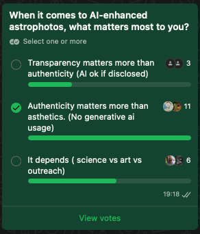
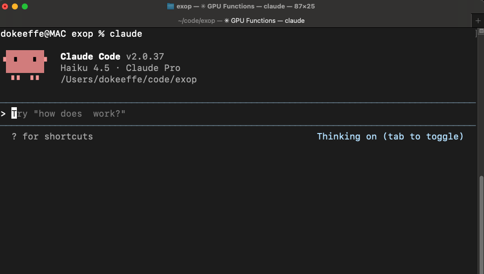
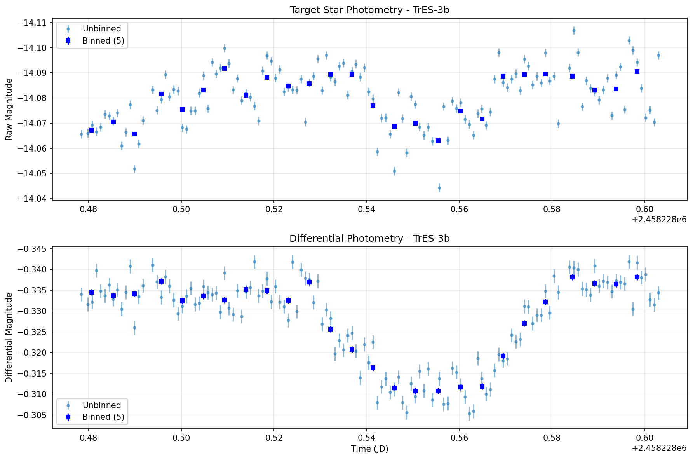

It built an *entire system*[^1] from scratch in less time than it previously took to analyse a single night's dataset. 
This is my recent experience on a rainy weekend with artificial intelligence (AI) in astronomy. Building a system to find planets orbiting distant stars (exoplanets) from a few hundred images of the same patch of sky.
Prior to this, I would have fed these images into *traditional* software and let it churn for about 12 to 15 hours before seeing the output,
the characteristic dip in brightness caused by a distant planet crossing in front of its 'sun'.
If the traditional software takes half a day to process ~4Gb of data from a small observatory, imagine the challenges when LSST comes online with 500x more data per night (~20Tb/night).

### The problem

"It can't do it yet" is a common quote I've heard a few times from astronomers when it comes to using AI to extract knowledge from data. In my opinion, they are correct, and it may never be able to 'do it'
Astronomers are right to be cautious 
Ever since late 2022 when ChatGPT was released there has been a huge boom and hype around AI I feel there is some reluctance to use AI in Astronomy. This is just my opinion and stems from what we commonly call AI in 2025 which is really a specific type of AI built on human language (Large language models). 

why astronomers are RIGHT to be cautious
Reinhard Genzel, a Nobel laureate and an astrophysicist at the Max Planck Institute, expressed some skepticism[^2]

"What if AI doesn't touch the data at all—it just writes the code that does?" ---- AI to change the process vs. AI to change the data

### The central idea. What if...

so above is all generative AI. The example of nobel laurate and the black hole stuff, APOD example of gen images, the whatsapp group poll, the quote from astronomer "cant do it yet."
Now, what if AI does not touch the data at all. It does not generate direct insights from data. What if we take a different angle and use AI to generate code that does.
Here's what everyone is missing. Generative AI is really great for generating code, It can accelerate the entire process. <Marks quote> changes the process not the data.

insert something here to further clarify ai changing the process not the data. Maybe an image

#### Vibe coding a solution (the process)

***My background**: I'm an amateur astronomer and a professional software engineer. I don't have academic qualifications in astronomy but have completed some AAVSO courses in photometry am reasonably competent in that narrow field with about 8 years experience.*

What is Claude Code? 

Include some actual prompts. 

Include final image of TrES3b
<figure>
  
  <figcaption>Actual exoplanet transit plot output from the AI-generated code described in this post. Raw data taken by this observatory.</figcaption>
</figure>

#### Insights and surprises
* Claude-code's knowledge of astro image processing was beyond anything I imagined. 
  * It knew about specific noise reduction methods that I was only vaguely aware of. It knew how to implement these in code.
  * It knew a specific method of generating a synthetic comparison star by Broeg et al.[^4] which I had read about but would have struggled to implement. 
* Performance improvements. 
  * It knew what parts of the code could be performed in parallel to take advantage of multicore processors 
  * Its ability to write a performance benchmark test and iterate over code changes until it got faster and faster was astounding

## Appendix

On the use of AI in this post. <strong>Click to expand</strong>

      <strong>Disclosure:</strong> I believe in transparency about tool usage. Claude AI (Sonnet 4.5) was used to structure this blog post prior to writing but the writing is my own and not modified afterwards.

<strong>Claude code history</strong>

  Below is the entire history from Claude Code which generated the exop application's codebase.
 
 1. **2025-10-18 17:04:08** - I'm creating a new app to do timeseries photometry on a set of fits files. Astropy has good libraries to use for photometry but I'm open to using another language.
 2. **2025-10-18 20:38:29** - This looks great. I have changes to make. All my fits files have wcs headers so I would like to specify the target coords and ref coords using RA and DEC coordinates of the stars. Astropy can convert RA and DEC to X Y coords
 3. **2025-10-18 20:55:36** - I got this error from some test data. Any idea? Error: ufunc 'isfinite' not supported for the input types, and the inputs could not be safely coerced to any supported types according to the casting rule ''safe''
 4. **2025-10-18 21:01:58** - Wowo it works pefectly. Next, for the differential feature, I would like it to automatically select comparison stars instead of having to specify them. To do this it would need to find stars with similar brightness to the target star and also not near the edge of frame as this may suffer from some intrinisc noise. Next I would like it to select the best comparison stars by finding the stars which vary less over all the time series data. Possibly the ones with lowest standard deviation over the timeframe of all images. If possible I would also like the processing to be in parallel
 5. **2025-10-18 21:09:31** - I get an error. Probably a dependency missing. No module named 'skimage'
 6. **2025-10-18 21:13:54** - My image data is not perfect and the WCS is a little off. Can you change the code to search a 10 pixel radius for the source of the target star? I think its not finding my target star
 7. **2025-10-18 21:31:12** - make a CLAUDE.md file for context of the next session
 8. **2025-10-18 21:38:10** - How are the parameters for the aperture radius decided in this code? This is when doing photometry with astropy
 9. **2025-10-18 21:45:14** - Wow its really working well now. Next I want to make a small change to the plot of Differental magnitude. I'd like to flip the Y axis so dimmer readings are lower down the image and brigher readings are higher up the image
 12. **2025-10-19 19:22:22** - The code works well for differential photometry and is plotting the exoplanet transit. However I notice that choosing different values for --n-comparison-stars gives me slightly better results sometimes and slightly worse results other times. The noise in the differential plot depends on the number of comparison stars. I would like it if could automatically find the optimal number of comparison stars by defining some sort of loss function and the optimizing it.
 13. **2025-10-19 19:33:59** - can you update the README to reflect this
 14. **2025-10-19 19:41:36** - The optimization works great. Next, I'd like to experiment with optimization of the radii used for aperture photometry. Currently we are using the FWHM and its working well. However I now would like to use optimal aperture and annulus radii for each image instead of the set of images. This is because seeing conditions vary a lot across all images and sometimes there are variations in focus. Please update the code to check the FWHM of individual images and optimize the radii based on this for each image when doing photometry on each image
 15. **2025-10-19 19:51:12** - IS this per-image optimization also implemented when doing differential photometry?
 16. **2025-10-19 19:52:47** - update CLAUDE.md based on today's changes
 17. **2025-10-19 20:34:21** - The --optimize-per-image works great for differential. However its a little time consuming. Is it possible to parallelize this operation?
 18. **2025-10-19 20:44:54** - Wow now its fast!. There is one issue with an outlier in the plot though. There is a single bad datapoint which is so far from the others that it expands the Y axis and the 'dip' in brightness caused by the exoplanet transit is a little difficult to see. Please add an option to the exop differential command which can be set to exclude outliers beyond a definable threshold
 19. **2025-10-19 20:58:32** - I used this command but the outlier did not get eliminated.
 20. **2025-10-19 20:58:48** - I used this command but the outlier is still there. exop differential testdata/XO-2b/*.fits --target-ra-dec "07:48:06.3,+50:13:31.03"  --auto --sigma-clip 3.0 --optimize-n-stars --optimize-per-image --search-radius=5 --output curve.csv
 21. **2025-10-19 22:17:09** - It is now successfully detecting the outlier in the csv file. Its the very first point in the data. However its still appearing as a blue dot in the differential plot and affecting the scaling of the Y axis badly
 22. **2025-10-19 22:23:18** - Looks good now. The only problem is that the Y axis on the Differential Photometry plot is now flipped. The brighter readings are now lower than the dimmer readings. Please flip the Y axis as this is astronomical magnitude measurements.
 23. **2025-10-19 22:34:05** - Can you update the README.md with detailed descriptions of the two plots. The "Target Star Photometry" plot and the "Differential Photometry" plot. I understand the Differential Photometry plot but I don't understand the Target Start Photometry plot.
 24. **2025-10-20 21:24:22** - I get this warning in the log when I run differential. I don't think its a problem though. photometry.py:220: RuntimeWarning: invalid value encountered in sqrt
      flux_err = np.sqrt(flux / gain + aperture.area * (readnoise / gain)**2)
 25. **2025-10-20 21:28:00** - I also get this warning when its displaying deblending progress bars. Sometimes the warning happens but not for all deblending steps. I don't think its a problem but can it be improved? Deblending:   0%|                                                         | 0/640 [00:00<?, ?it/s, ID: 4]/Users/dokeeffe/code/exop/venv/lib/python3.12/site-packages/numpy/_core/function_base.py:162: RuntimeWarning: invalid value encountered in multiply
      y *= step
 27. **2025-10-20 21:31:48** - The exoplanet plot is looking really really good now. What other methods could I use to further reduce noise in the final plot?
 28. **2025-10-20 21:35:59** - Please plan and implement Phase 1.
 29. **2025-10-21 19:55:12** - I get this error Error: TimeseriesAnalysis.bin_data() got an unexpected keyword argument 'bin_size'
 31. **2025-10-21 21:14:52** - What could be a good approach to build a UI for this application? Do not build it now. Just outline possibilities for a modern UI Keeping in mind some way to easily distribute the app to end users
 32. **2025-10-21 21:20:25** - Can you update the plots to include the name of the target star. This is usually in the fits header TARGET key. Although it may not exist. Write the code to be safe if it does not exist in the headers.
 33. **2025-10-21 21:27:37** - Nice that worked however the binning feature seems broken now. I specified --bin-size 5 which previously worked but now did not display in the plot
 34. **2025-10-21 21:30:41** - I know its a little late at this stage but is it possible to add unit tests for the important parts of this application?
 35. **2025-10-22 21:41:28** - run all tests
 37. **2025-10-26 18:13:26** - Please totally re-write the README.md now. I want to publish this project to github.com. Make it an awesome readme. Visually appealing, clear, consise and useful. Include the sample output image example-output-TrES-3b.png which is a plot generated by exop using automatic comparison star selections and all the noise reduction options, detrending, weighted comparison stars, variable fwhm etc etc
 38. **2025-10-26 18:18:13** - The performance section. Where did those numbers come from? If fabricated, please remove it.
 39. **2025-10-26 18:21:42** - The basic usage section is good. However the next section "then plot your results" is that ok? I've never had to do that because the basic usage example command generated a png file plot
 40. **2025-10-26 18:24:04** - Regarding GPU acceleration. Are there any parts of the processing that could be offloaded to the GPU? I have an M4 mac (apple silicon)
 44. **2025-10-26 20:10:01** - If the fits images have an AIRMASS header, can you also plot the airmass on the same plot. Use a dotted line and put the Y scale to the right side of the plot. Leave the magnitude scale on the left side of the plot
 45. **2025-10-26 20:13:40** - It all works great, I'd like to speed it up so I'd like to do some profiling or something to determine where the bottlenecks are? Is this possible? Can you do this? For example, here is the command I run now `exop differential testdata/TRES-3b/*.fits --target-ra-dec "17:52:07,+37:32:46"  --auto --detrend-airmass --optimize-n-stars --optimize-per-image --search-radius=5 --output curve.csv`
 46. **2025-10-26 20:29:57** - can you perform the first of the optimizations?
 47. **2025-10-26 20:42:49** - Does the background estimation handle gradients in the sky? My location is not good for astronomy so the background may suffer from gradients and/or passing thing clouds
 48. **2025-10-26 20:55:28** - I get this warning at the start of processing. WARNING: Input data contains non-finite (NaN or infinity) values, which were automatically masked. [photutils.background.background_2d]
 50. **2025-10-26 21:24:16** - Regarding the weighted ensemble implementation. Can you give me any citation for this? Is it in the literature?

## References

[^1]: [EXOP: Exoplanet Observation Photometry. AI generated timeseries photometry toolkit for exoplanet transit observations](https://github.com/dokeeffe/exop)
[^2]: [Nobel Prize Winner Warns About Astronomers Using AI to Make Discoveries](https://futurism.com/nobel-prize-warns-astronomers-using-ai#:~:text=Reinhard%20Genzel%2C%20a%20Nobel%20laureate%20and%20an%20astrophysicist,in%20what%20they’re%20doing%2C”%20Genzel%20told%20Live%20Science.)
[^3]: [Claude code: Generative AI coding assistant from Anthropic](https://claudecode.io)
[^4]: [Broeg, C. & Fernández, M. & Neuhäuser, R.. (2005). A new algorithm for differential photometry: Computing an optimum artificial comparison star](https://www.researchgate.net/publication/227518597_A_new_algorithm_for_differential_photometry_Computing_an_optimum_artificial_comparison_star)
[^5]: [Anthropic Claude generative AI](https://claude.com/product/overview)
[^6]: [Active Learning for Supernova Photometric Classification. Ishida et al, 2019, MNRAS, 483 (1), 2–18](https://cosmostatistics-initiative.org/projects/active-learning-for-supernova-photometric-classification/)
